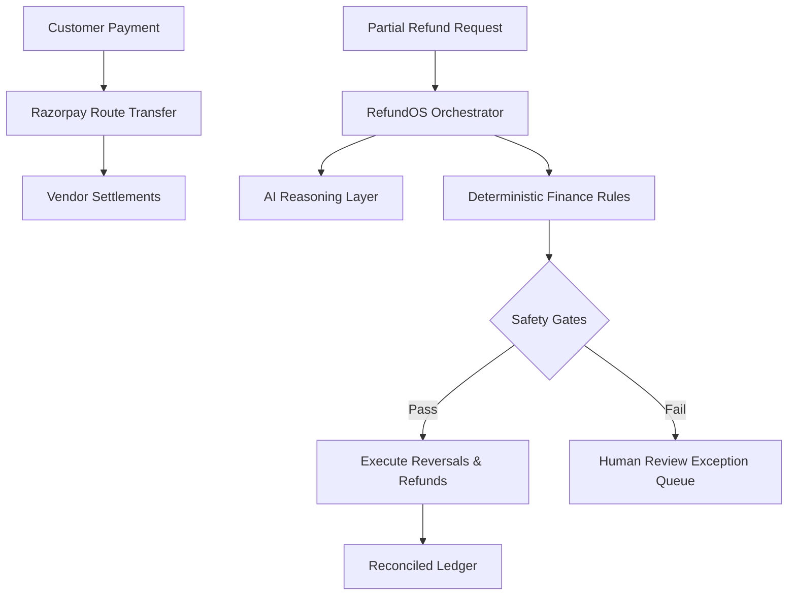

# RefundOS — AI Finance Controller

**AI that decides where every refund belongs — and proves the books reconcile.**

RefundOS is an AI-powered finance controller for marketplaces that split a single customer payment across multiple vendors. It reconstructs complex financial transaction graphs and intelligently routes partial refunds to the correct vendor transfer, avoiding over-refunds and duplication.

## The Problem

When a customer pays a single large amount across multiple vendors via a platform like Razorpay Route, partial refunds become complex. If a single item is returned, finance teams struggle to answer:
- Which vendor transfer should be reversed?
- Does the vendor have enough balance?
- Has this amount already been refunded?
- What are the tax implications?

RefundOS solves this. **AI proposes. Deterministic rules validate. Money movement is gated.**

## Architecture

## Features

- **Synthetic Dataset Generator**: Instantly generate 100+ complex marketplace records including anomalies.
- **Refund Command Center**: Step-by-step AI explanation and deterministic safety checks for partial refunds.
- **Transaction Explorer**: Instantly visualize the graph of any Order or Payment.
- **Exception Inbox**: Catch duplicate refunds, missing transfers, and over-refunds safely before execution.

## Getting Started

1. `npm install`
2. `npx prisma db push`
3. `npm run dev`
4. Access `http://localhost:3000`

## Demo Instructions

1. Hit the **"Overview"** page to see your metrics. If empty, invoke `POST /api/demo/generate` using a tool like Postman or Curl.
2. Navigate to **Command Center** to see an AI-evaluated partial refund for a returned item.
3. Observe how deterministic rules match the request to Vendor B's exact transfer ID and tax component, scoring a high confidence match.
4. Navigate to **Exceptions** to see how duplicate refunds or missing transfer cases are intentionally blocked and routed to Human Review.
5. Explore the exact money flow in the **Transaction Explorer**.

## Environment Variables

- `DEMO_MODE=true` (simulates Razorpay webhooks without requiring live keys)
- `OPENAI_API_KEY=` (optional, used for live AI explanation generation; falls back to mock securely if omitted)
- `RAZORPAY_KEY_ID=` (live mode only)
- `RAZORPAY_KEY_SECRET=` (live mode only)
